# Profile README explorations

This PR now contains **17 complete README directions**, not just header treatments. They intentionally disagree about what a premium GitHub profile should feel like.

The current root README uses **04 — Executive minimal** as a neutral baseline. Nothing here is considered final.

| # | Direction | Visual idea | Best if we want… |
| --- | --- | --- | --- |
| **01** | [Editorial](./concepts/01-editorial.md) | Custom typographic masthead + restrained body | a design-studio / editorial feel |
| **02** | [Personal mark](./concepts/02-personal-mark.md) | MB monogram + compact four-part stack | a reusable personal identity |
| **03** | [Statement](./concepts/03-statement.md) | Thesis-first custom hero | a memorable point of view |
| **04** | [Executive minimal](./concepts/04-executive-minimal.md) | No hero; typography + one capability table | maximum restraint and seniority |
| **05** | [Full-stack dashboard](./concepts/05-full-stack-dashboard.md) | Compact badges + 2×2 capability matrix | immediate technical scanability |
| **06** | [Terminal](./concepts/06-terminal.md) | CLI language + concise prose | playful engineer-native personality |
| **07** | [Technical dossier](./concepts/07-technical-dossier.md) | Spec-sheet / capability-map aesthetic | systems-engineering character |
| **08** | [System map](./concepts/08-system-map.md) | Architecture diagram as the identity | making “full stack” visual |
| **09** | [Product portfolio](./concepts/09-product-portfolio.md) | Editorial case-study layout | product-engineering sophistication |
| **10** | [Signal strip](./concepts/10-signal-strip.md) | Clean technology icon strip + structured copy | polished familiarity without a badge wall |
| **11** | [Hybrid](./concepts/11-hybrid.md) | #9 copy + #4 restraint + subtle full-stack flow | the strongest balance of personality, scanability, and polish |
| **12** | [Aurora](./concepts/12-aurora.md) | Full-bleed violet / cyan / coral gradient | premium product-company energy |
| **13** | [Swiss color blocks](./concepts/13-swiss-color-blocks.md) | Bold cobalt, coral, yellow, and lime geometry | graphic/editorial impact |
| **14** | [Midnight prism](./concepts/14-midnight-prism.md) | Dark surface with a luminous spectrum accent | polished dark-mode drama |
| **15** | [Full-stack bento](./concepts/15-full-stack-bento.md) | Color-coded stack tiles | making full-stack breadth the visual identity |
| **16** | [Magazine cover](./concepts/16-magazine-cover.md) | Oversized editorial typography + strong color blocks | maximum personality |
| **17** | [Signal flow](./concepts/17-signal-flow.md) | A colorful path through the whole stack | a modern visual story of full-stack work |

## Color / impact round

These six intentionally move away from understated minimalism. They test how far the profile can go toward **color, personality, and visual impact** without becoming a generic developer-template README.

### 12 — Aurora

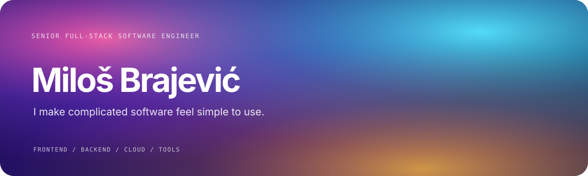

### 13 — Swiss color blocks

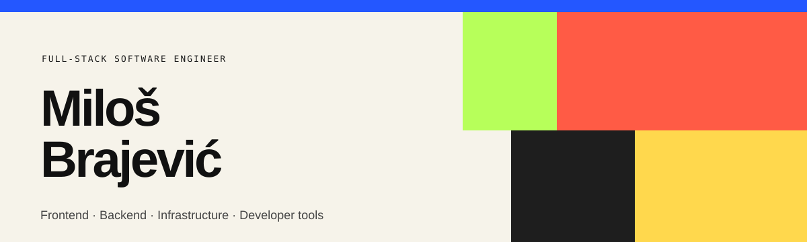

### 14 — Midnight prism

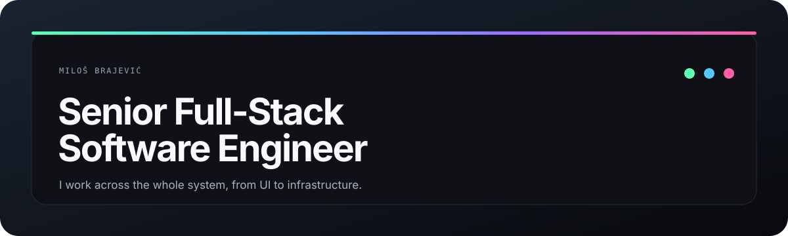

### 15 — Full-stack bento

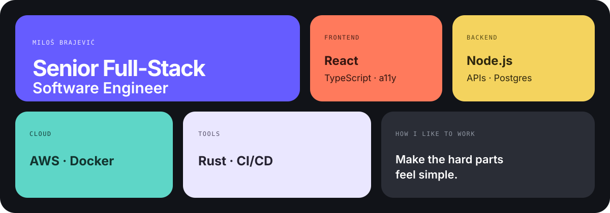

### 16 — Magazine cover

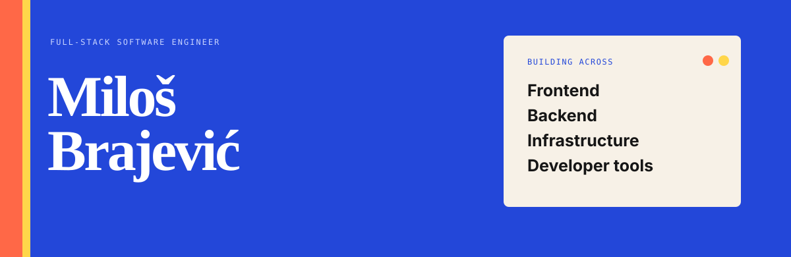

### 17 — Signal flow

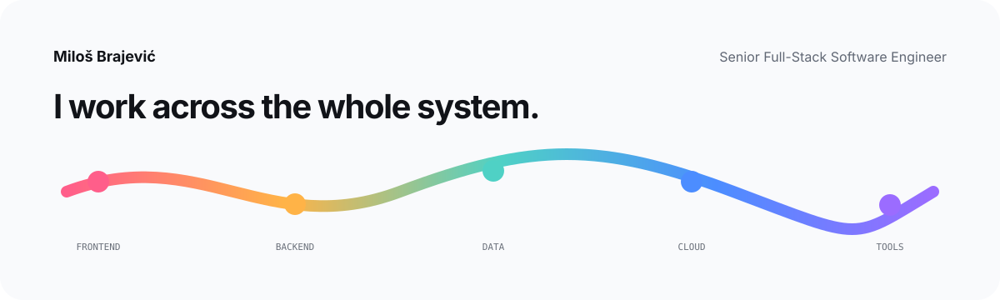

## #15 family — current direction

The original **#15 Full-stack bento** is unchanged. These are six new refinements of the same idea:

### 15A — Refined bright

Fewer colors, warmer background, cleaner spacing, and a calmer visual hierarchy.

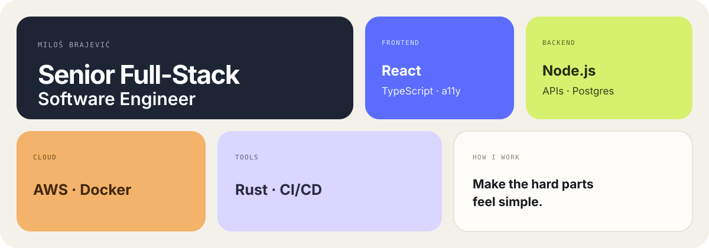

[Open full README](./concepts/15a-bento-refined.md)

### 15B — Dark luxe

A darker, more restrained version with muted jewel tones and a warmer light tile for contrast.

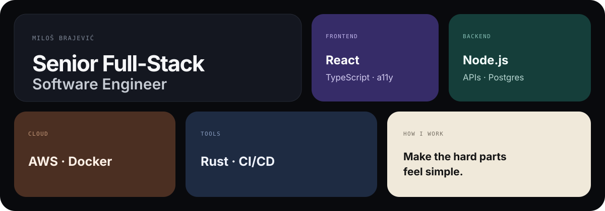

[Open full README](./concepts/15b-bento-dark-luxe.md)

### 15C — Editorial bento

Fewer, larger blocks; more whitespace; larger type; and a stronger editorial composition.

[Open full README](./concepts/15c-bento-editorial.md)

### 15D — Icon bento

The 15A palette with integrated category icons and richer tile detail. This is the **recommended icon treatment**.

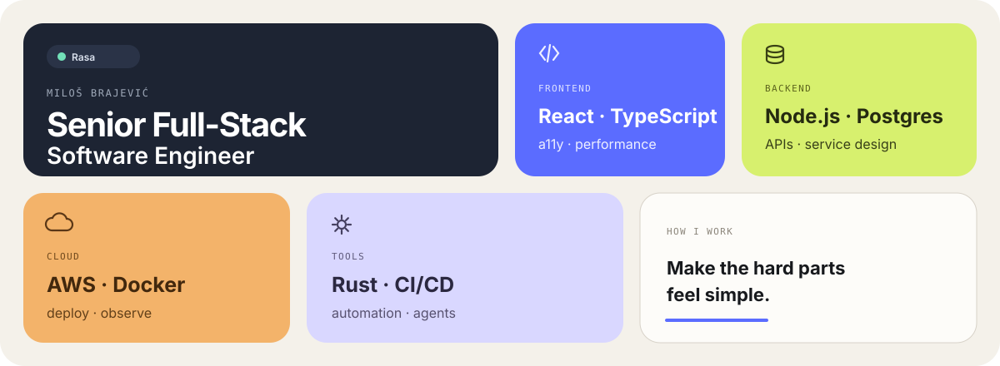

[Open full README](./concepts/15d-icon-bento.md)

### 15E — Badge bento

A control variant that uses compact technology chips inside the bento. This tests whether badge-like UI adds polish or starts to feel like a typical GitHub profile.

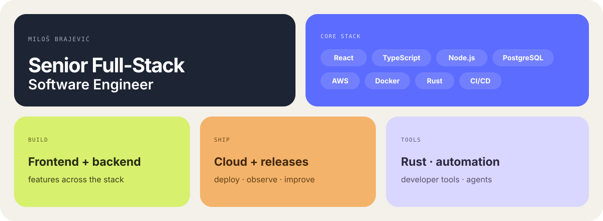

[Open full README](./concepts/15e-badge-bento.md)

### 15F — Product bento

The 15D visual system, but organized around responsibilities instead of technologies: **Product · Systems · Platform · Engineering**. Technologies are supporting evidence rather than the headline.

[Open full README](./concepts/15f-product-bento.md)

The newer variants deliberately **demote open-source work to a footer link**. The profile is about Miloš first; individual repositories are supporting evidence rather than the main story.

## Current finalists

The current direction is the **#15 bento family**:

- **[15 — Original](./concepts/15-full-stack-bento.md):** the first colorful bento direction.
- **[15A — Refined bright](./concepts/15a-bento-refined.md):** calmer, cleaner, more premium.
- **[15B — Dark luxe](./concepts/15b-bento-dark-luxe.md):** darker and more restrained.
- **[15C — Editorial bento](./concepts/15c-bento-editorial.md):** fewer blocks and stronger typography.
- **[15D — Icon bento](./concepts/15d-icon-bento.md):** integrated category icons; strongest polish candidate.
- **[15E — Badge bento](./concepts/15e-badge-bento.md):** compact technology chips; useful control against the icon approach.
- **[15F — Product bento](./concepts/15f-product-bento.md):** same polish as 15D, but product/system responsibilities lead and technologies recede.

The root README currently mirrors **04 — Executive minimal** as the neutral baseline.

## Three custom-hero directions

### 01 — Editorial

<picture>
  <source media="(prefers-color-scheme: dark)" srcset="./assets/direction-a-editorial-dark.svg">
  <source media="(prefers-color-scheme: light)" srcset="./assets/direction-a-editorial-light.svg">
  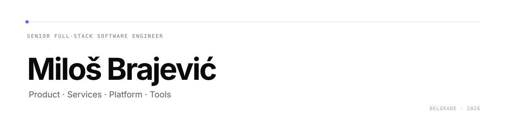
</picture>

### 02 — Personal mark

<picture>
  <source media="(prefers-color-scheme: dark)" srcset="./assets/direction-b-mark-dark.svg">
  <source media="(prefers-color-scheme: light)" srcset="./assets/direction-b-mark-light.svg">
  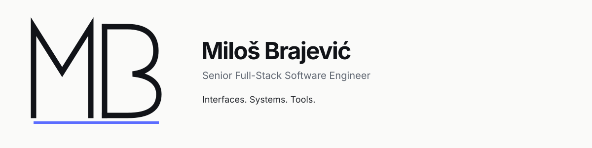
</picture>

### 03 — Statement

<picture>
  <source media="(prefers-color-scheme: dark)" srcset="./assets/direction-c-statement-dark.svg">
  <source media="(prefers-color-scheme: light)" srcset="./assets/direction-c-statement-light.svg">
  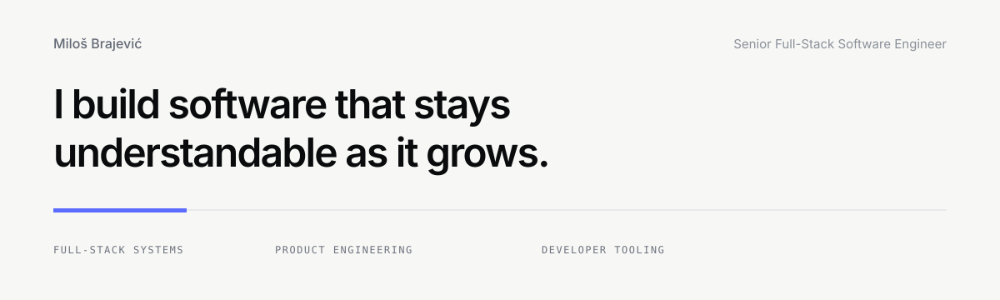
</picture>

## Positioning shared across the exploration

Every direction now presents Miloš as a **Senior Full-Stack Software Engineer**, not a frontend specialist.

The recurring scope is intentionally broader:

**product interfaces → backend services → data → cloud/platform → developer tooling**

The visual treatment and amount of technical detail vary; that full-stack positioning does not.
