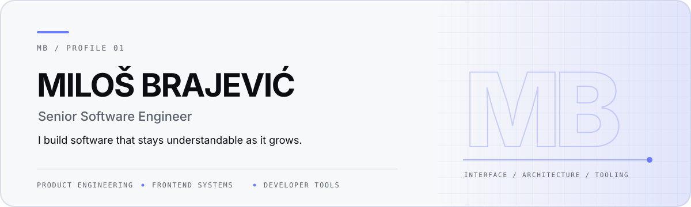

<picture>
  <source media="(prefers-color-scheme: dark)" srcset="./assets/profile-hero-dark.svg">
  <source media="(prefers-color-scheme: light)" srcset="./assets/profile-hero-light.svg">
  
</picture>

  <a href="https://www.linkedin.com/in/brajevicm/"><strong>LinkedIn ↗</strong></a>
  &nbsp;&nbsp;·&nbsp;&nbsp;
  <a href="https://medium.com/@brajevicm"><strong>Writing ↗</strong></a>

## About

I build software that stays understandable as it grows.

I'm a senior software engineer at **[Rasa](https://rasa.com/)**, working across **product engineering**, **frontend architecture**, and **developer tooling**. I care about turning complex systems into interfaces and workflows that feel simple — without sacrificing performance, accessibility, or maintainability.

Most days are **TypeScript**, **React**, and **Node.js**. **Rust** is becoming a larger part of my tooling work.

## What I optimize for

- **Clarity over cleverness** — architecture that remains legible under change.
- **Product quality over surface polish alone** — fast, accessible interfaces backed by sound systems.
- **Fast feedback over late enforcement** — tooling that makes the right thing easier to do.

## Open source

**[next-universal-route](https://github.com/brajevicm/next-universal-route)** — a universal routing layer for Next.js built around explicit, reusable routes across client and server.

TypeScript · React · Node.js · Rust · AWS
