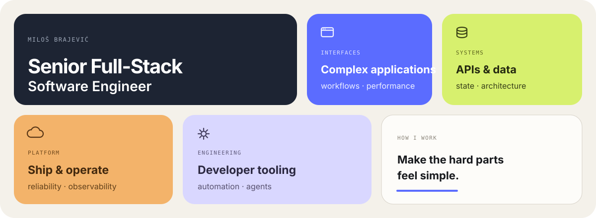

## I make complicated software feel simple to use.

I like working across the boundaries of a product: the interface people use, the systems behind it, the platform it runs on, and the tools that make the team faster.

I'm happiest on problems where those parts affect each other — data-heavy products, tricky workflows, performance, reliability, releases, and developer tooling.

TypeScript · React · Node.js · PostgreSQL · Rust
